## Prerequisites

Have your personal IAM account

## Test your account by running following testing examples

### Test the Lamda function that send forest data to Kinesis
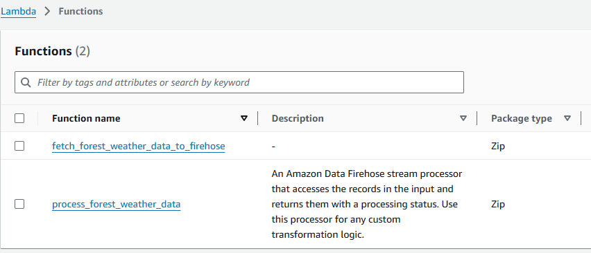

Go to function fetch_forest_weather_data_to_firehose, read the basic code logic, go to the Test section, run the following testing event. Click on Test, you will send a record to Kinesis

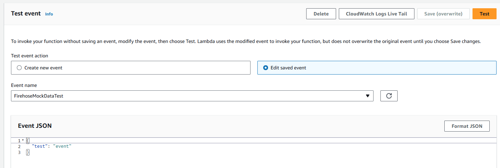

For a success case, you will see:

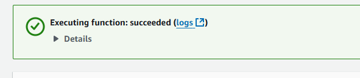

And you can find timestamp in log:

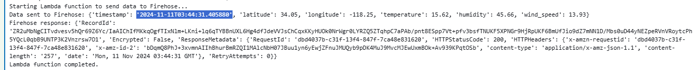

### Test the Lamda function that process response from  Kinesis

Go to Lambda-> Functions -> process_forest_weather_data, run the following test event

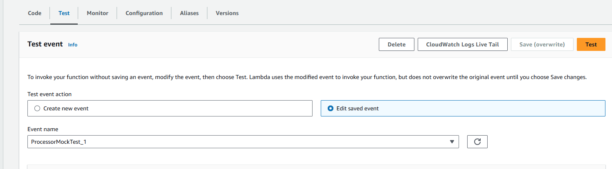

## Verify your record was accetped in S3

For a successfully sent and processed data, you will find in S3 weather_data folder. After sending the data in lamda function, please wait few seconds before you check the S3 page 

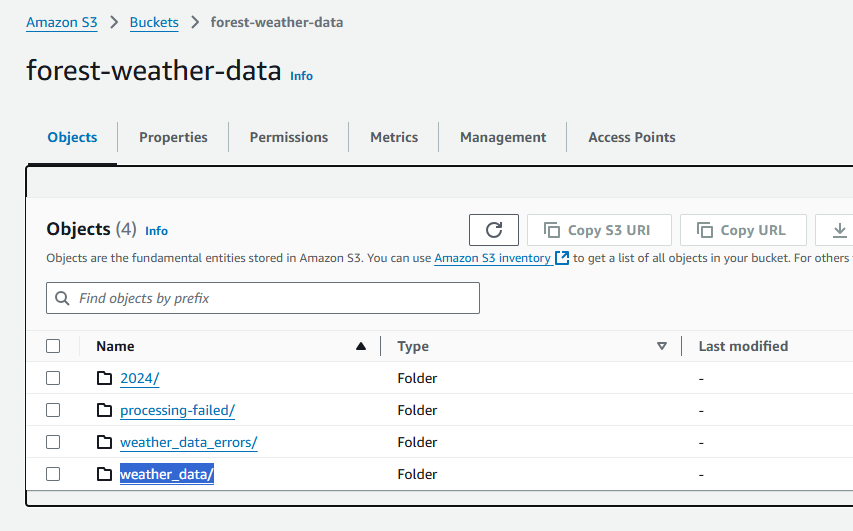

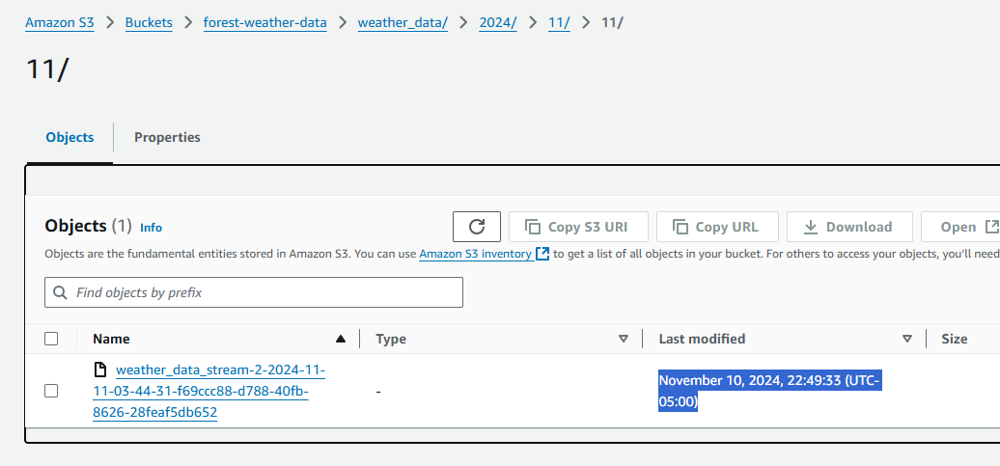

### Debugging 
If you don't see your data, check if there is an error. GO to Firehose, find following stream:

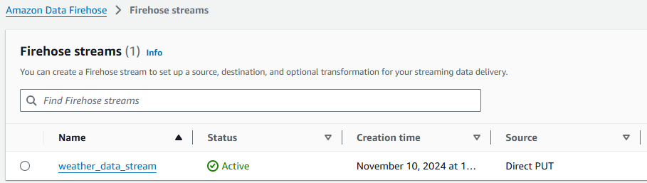

Go to Destination error log, find the latest one (or the one that matches your send time), please notice you are seeing your local time zone (EST) here.

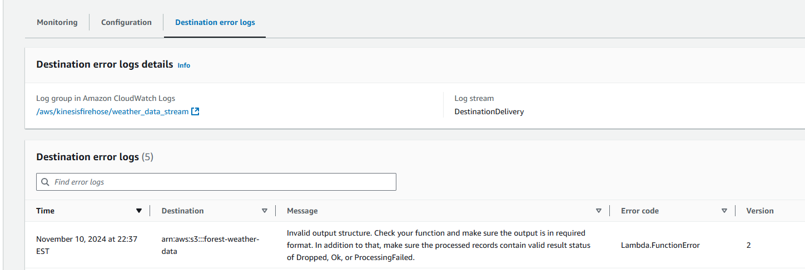

For more detail about the error, go to CloudWatch, open the log group (or check all groups). In our case, it's very likely the error happens in processor.

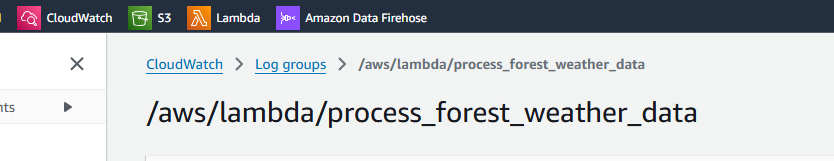

Find the log with Lst Event Time that is close to your event time, please note you are seeing UTC time here

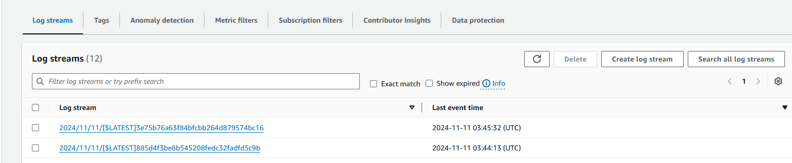

And error usually start with [ERROR]

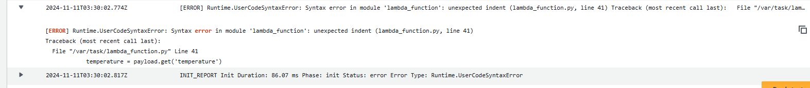

## Kenisis key configuration

The lamda function that process the response:

S3 bucket name, the error file name prefix and data file prefix

